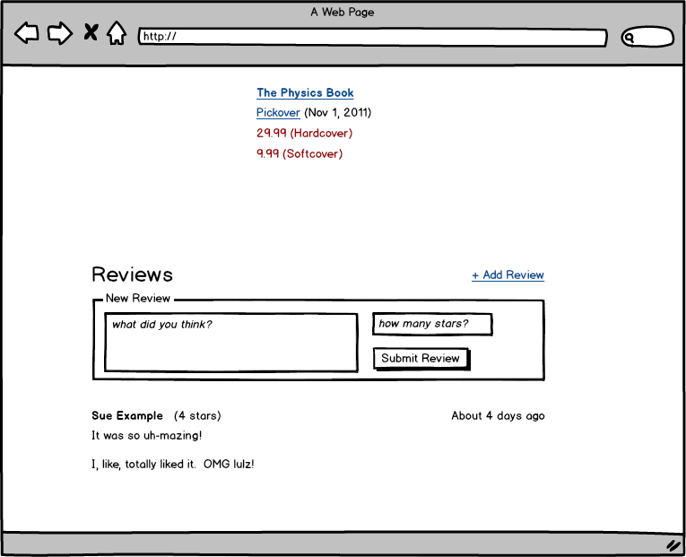
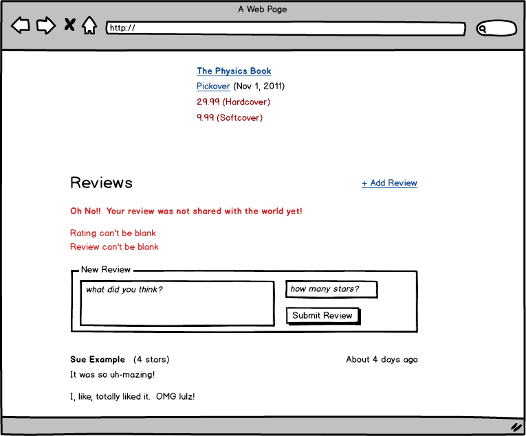

# Rails Practice Store Reviews

Based on the g2-store built by students of gSchool Boulder, August 2014

## Setup

1. Fork and clone this repository
1. Install required gems ``bundle install``
1. Create test and development databases ``rake db:create:all``
1. Run the migrations ``rake db:migrate``
1. Run the migrations ``rake db:seed``
1. Get the app running locally ``rails server``
1. View the app in your browser ``localhost:3000``

## Stories

**Users can add reviews to products**
```
When I am on a project show page
And I am a logged in user
Then I can add a review to a product
```

**Users must enter both the review and the rating**
```
When I am on a project show page
And I am a logged in user
And I am adding a review
If I forget to add a rating or comment
Then I should see validation errors
```

**Line breaks in the review should appear on the rendered page**
```
If a user enters line breaks
They should be preserved on the show page
```

## Wireframes

reviews



w/ errors

